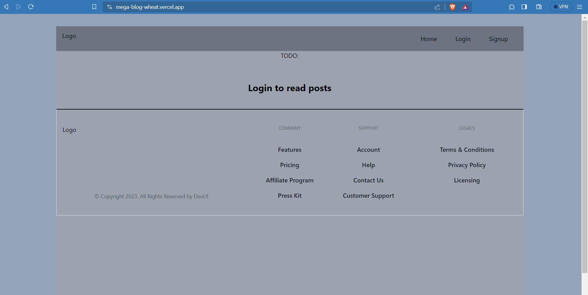
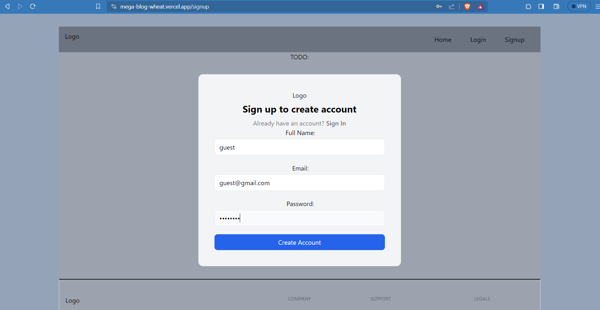
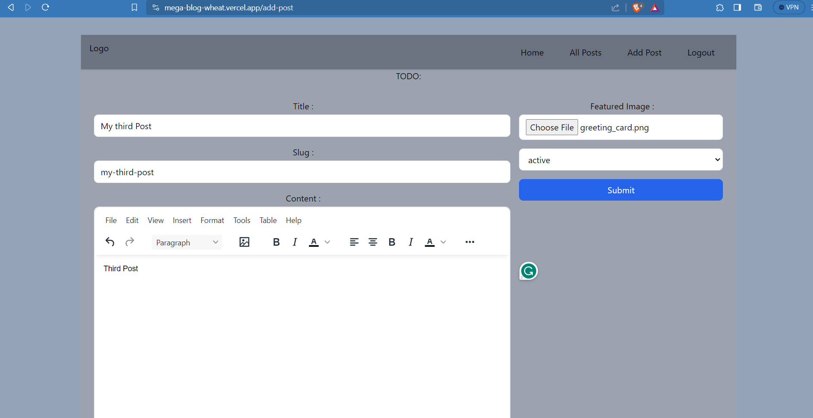
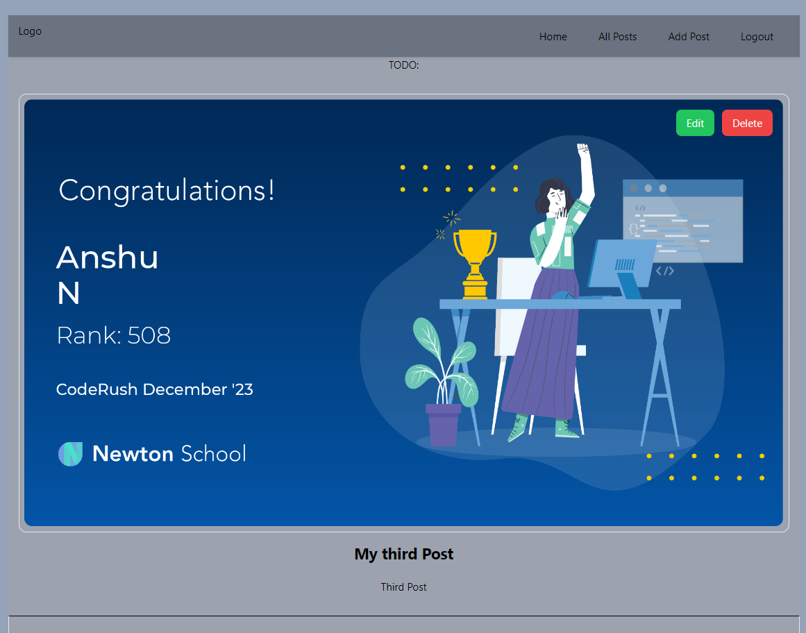
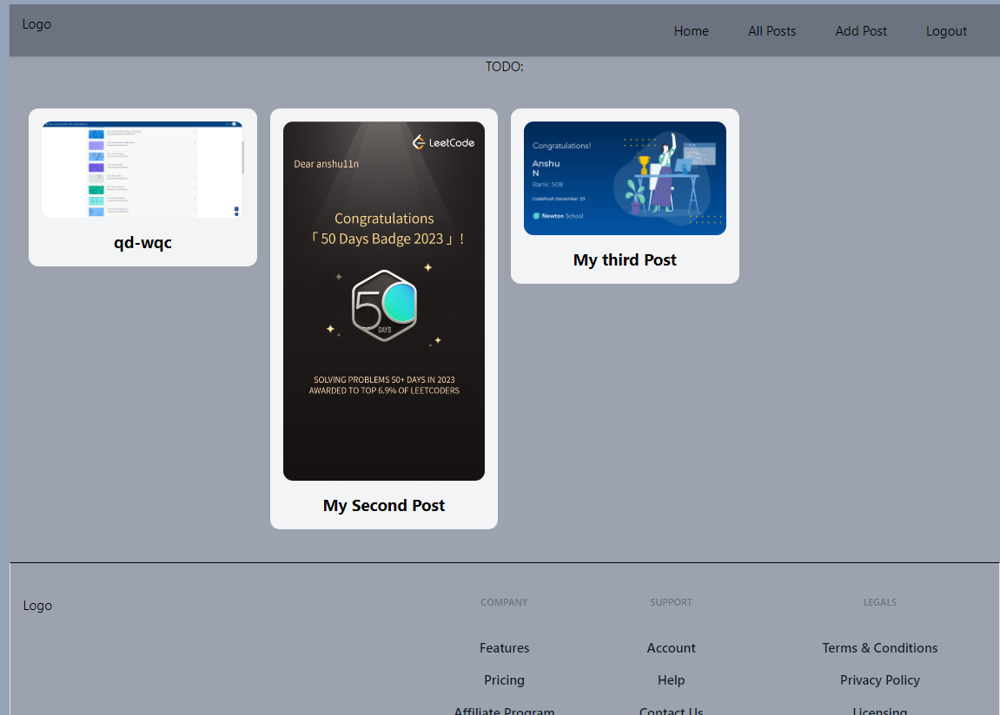

# Mega Blog

Mega Blog is a dynamic web application that empowers users to create, share, and explore blog posts. It's built with Vite and React.js, utilizing Appwrite as the backend for user authentication and data storage.

## Features

- **User Authentication:** Secure signup and signin powered by Appwrite for a seamless user experience.
- **Dynamic Blog Creation:** Users can create personalized blog posts using a rich text editor (TinyMCE) and streamlined input forms (React Hook Forms).
- **Efficient State Management:** Redux ensures scalable and smooth user interactions.
- **Intuitive Navigation:** React Router provides seamless navigation for an enhanced browsing experience.
- **Access Controls:** Strict access controls prevent unauthorized edits or deletions of others' blog posts.
- **Deployment:** The application is deployed on [Vercel](https://mega-blog-wheat.vercel.app/), showcasing proficiency in the deployment process.

## Getting Started

1. Clone the repository: `git clone https://github.com/anshu11n/MegaBlog.git`
2. Install dependencies: `npm install`
3. Run the application: `npm run dev`
4. Open your browser and visit `http://localhost:5173`

## Tech Stack

- **Frontend:** React.js, Vite
- **State Management:** Redux
- **Routing:** React Router
- **Form Handling:** React Hook Forms
- **Text Editor:** TinyMCE

## Deployment

The live version of the project is accessible at [https://mega-blog-wheat.vercel.app/](#).

## Demo 

## Contact

For inquiries, please contact [Anshu Nauwala] at [nauwalaanshu11@gmail.com].

Happy Blogging!
